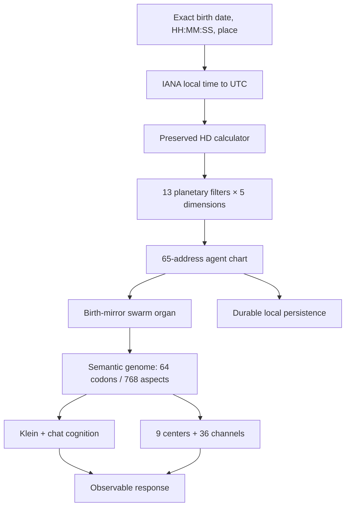

# Acceptance Verification — Synthia Integrated Automata v0.5.1

**Verification date:** 2026-09-20  
**Authority:** this document supersedes completion language in the earlier
Implementation Report, Request Completion Matrix, and Regression Report  
**Status vocabulary:** `PRESENT`, `PARTIALLY WIRED`, `WIRED`, `VERIFIED`

## Outcome

The required birth-mirror path is now runtime-connected and has been executed
from exact local birth input through persisted chart construction, the named
swarm worker, cognition, semantic-genome expression, center routing, and final
chat output. It is not labeled fully complete because the preserved astronomy
calculator is approximate, the Movement/Magnetic-Monopole landing grammar is
still unresolved, and the complete line-level Black Book source overlay has
not been entered and verified.

## What existed before this repair

- The Human Design calculator and blueprint generator existed in the preserved
  Kimi package, but birth data was not a mandatory application boot input.
- `FederatedSynthia` created a generic deterministic chart before a personal
  chart existed, so conversation and execution could proceed without first
  constructing the intended mirror.
- The delivered chart modeled 13 planet records, not the confirmed 13
  planetary filters across all five dimensions (65 intersections).
- Agent charts and integration-local state could remain in memory without a
  process-restart restoration proof.
- The front screen exposed runtime controls without first requiring exact birth
  date, time including seconds, and structured birthplace.
- The swarm had no named worker whose runtime responsibility was to resolve and
  express the active birth configuration on every personalized task.
- Degree and Arc still had compatibility-era representations that did not match
  Degree 0–31 and Arc 0–99.
- Previous reports used `Implemented` and `Complete` without consistently
  proving all ten wiring conditions.

The full pre-repair working tree is preserved at
`backups/Synthia-Integrated-Automata-v0.5.1-pre-acceptance-audit.tar.gz` with
SHA-256
`984fc76af47b1989cb5ec38a2ad4ee2aa745be1d2571fa3bc1d1899fcb1d9368`.

## What was preserved

- All six original ZIP authorities remain byte-for-byte preserved under
  `authorities/originals/`; their hashes are still verified by the suite.
- All extracted vendor trees, donor architecture, prompts, datasets, neural
  organs, Klein systems, state-space modules, centers, channels, and historical
  compatibility logic remain present.
- No source authority, schema, prompt, component, or prior implementation was
  deleted during this repair.
- The five user-supplied dimension images and the supplied Black Book PDF are
  preserved under `authorities/black-book-dimension-perspectives/` with hashes,
  ordering, provenance, and a public-distribution warning in its `MANIFEST.md`.
- Competing donor claims remain alternatives; verified overlays do not erase
  them.

## What changed

- Birth time parsing now retains `HH:MM:SS` instead of discarding seconds.
- The live address is now exactly: Planetary, Dimension, Gate, Line, Color,
  Tone, Base, Degree, Minute, Second, Arc, Zodiac, House.
- Degree is 0–31, Minute and Second are 0–59, and Arc is 0–99. No additional
  cryptographic identity hash was added; the atomic coordinates are the
  differentiation layer.
- A chart now contains 13 planetary filters in each of the five dimension
  frames: 65 filter intersections while preserving one genome identity.
- Planet names from the donor calculator are explicitly mapped to the live
  planetary-filter registry rather than assumed to share numeric order.
- Evolution and Space use the Personality stream; Being and Design use the
  Design stream. Movement is represented by an explicit replaceable provider
  rule and remains marked unresolved rather than being hardcoded as canon.
- Runtime persistence now serializes and restores typed `Map`/`Set` state and
  reconstructs executable process prototypes instead of restoring inert plain
  objects.
- The public API no longer exposes the raw birth date, time, or place.

## What was added

- `src/identity/birth-location-provider.mjs`
- `src/identity/dimension-landing-provider.mjs`
- `src/identity/birth-mirror-runtime.mjs`
- `src/identity/mirror-expression-organ.mjs`
- `src/persistence/file-runtime-store.mjs`
- `test/11-birth-mirror-runtime.test.mjs`
- `test/helpers.mjs`
- first-screen birth configuration form and `/api/identity` endpoints
- five-dimension authority manifest and source hashes

## What is connected now

The birth configuration is mandatory by default. Chat, artifact execution,
cultivation, state-space work, and execution-tray work all call the same
personalization gate. Every personalized call submits work to the named
`birth-mirror-expression-organ`; its resolved address and configuration enter
the real cognition context, semantic-genome activation, observer frame, center
selection, channel propagation, and returned trace.

## Evidence states

| Major component | State | Evidence and boundary |
|---|---|---|
| Pre-repair recovery checkpoint | VERIFIED | Archive exists and its SHA-256 is recorded above. |
| Six original source archives | VERIFIED | All six byte hashes are checked by `npm test` and `npm run verify`. |
| Five dimension images + supplied PDF | VERIFIED | Six additional hashes are checked by `npm run verify`; order and provenance are in the authority manifest. |
| Mandatory birth configuration gate | VERIFIED | Unconfigured chat raises `BIRTH_CONFIGURATION_REQUIRED`; HTTP chat returns 409. |
| Exact local seconds and timezone conversion | VERIFIED | `12:34:56 America/New_York` resolves to `17:34:56Z`; nonexistent and ambiguous DST times surface explicit errors. |
| Birthplace coordinates in house calculation | VERIFIED | Latitude and longitude enter the replaceable house provider during the executed path. |
| Place-name geocoding | PRESENT | The form accepts the label plus latitude, longitude, and IANA timezone; automatic city lookup is not connected. |
| Preserved Human Design calculation | PARTIALLY WIRED | It receives real birth input, but uses low-precision planetary formulae and an approximate 88-day design offset. |
| Canonical house semantics | PARTIALLY WIRED | A tropical equal-house provider runs end to end, but it is an explicit engineering choice, not claimed as canonical Human Design. |
| Five dimension perspective registry | VERIFIED | All five distinct observer views, nonreciprocal projections, source-specific orderings, and source images are in the runtime snapshot. |
| Movement/Magnetic-Monopole landing grammar | PARTIALLY WIRED | A replaceable provisional stream rule is live; the authoritative landing grammar remains unsupplied. |
| 13 filters × 5 dimensions | VERIFIED | Every configured chart contains exactly 65 intersections: 13 in each dimension frame. |
| Atomic coordinate model | VERIFIED | Runtime and tests preserve Degree 0–31, Minute/Second 0–59, Arc 0–99, Zodiac, and House. |
| No added identity hash | VERIFIED | Chart and capacity snapshots report `cryptographicIdentityHashAdded: false`. |
| 64 codons / 768 signed aspects | VERIFIED | 64 persistent codons, 12 aspects and six dyads each, with zero dimension identity copies. |
| Planetary-filter punctuation layer | VERIFIED | Five-dimension filter outputs form the semantic vector used by downstream expression. |
| Birth-mirror swarm worker | VERIFIED | Real swarm executions identify `birth-mirror-expression-organ`; configuration and per-task calls are observed. |
| Cognition and final expression | VERIFIED | Two different birth records produce different identity addresses, sensory controls, and final utterances for the same task. |
| Feelings, taste, smell, color, shape, sound, voice, touch, movement, intake, code, skill, and tools | VERIFIED | These controls are produced by live genome activation and affect the chat adapter’s observable output. They remain project-model semantics, not biological claims. |
| Nine-center computation | VERIFIED | Nine meshes receive configured genome state and execute center routing. |
| Thirty-six channel meshes | VERIFIED | All 36 canonical channels are mounted; 16–48 is Spleen↔Throat and 21–45 is Heart↔Throat. |
| Four shared neural forms and channel analogues | VERIFIED | Runtime executes the four-organ/three-layer channel field across five dimensions. Correspondences retain `PROJECT_HYPOTHESIS` status. |
| Full 384-line source meanings | PARTIALLY WIRED | Donor records remain available, but only Gate 25.4 has a directly verified Black Book overlay in `LineMeaningProvider`. |
| Private birth/chart persistence | VERIFIED | Birth configuration, 65 placements, mirror weights, typed maps, and chat capability restore after a new process construction. |
| Failure surfacing | VERIFIED | Missing birth configuration, scope mismatch, DST gaps/ambiguity, malformed data, swarm failure, and persistence failure are not silently swallowed. |
| Identity HTTP API | VERIFIED | Integration test configures identity, observes readiness, then executes chat and tray paths. |
| First-screen birth form and client controls | PARTIALLY WIRED | HTML, client code, lock state, API calls, and HTTP flow exist. The cloud browser blocked the local loopback URL (`ERR_BLOCKED_BY_CLIENT`), so no visual browser execution is claimed in this pass. |
| Execution tray after identity configuration | VERIFIED | HTTP test invokes the live five-level hand after identity configuration; catalog currently contains 451 targets. |
| Rich Klein physical sensor adapter | PRESENT | Preserved in the Klein game-engine donor; it is not the normal chat intake. |
| External DOM/browser/network/file/Linux hands | PARTIALLY WIRED | Preserved binders and runtimes exist, but the ordinary front-server boot does not auto-bind every host hand. |
| Public GitHub copy | PRESENT | Packaging script and documentation exist, but this working tree is not a Git repository and no current push/round-trip verification was performed. |
| Public Supabase copy | PRESENT | Prior documentation references a checkpoint, but no live Supabase runtime or current upload/download verification is connected in this working tree. |

## What remains disconnected or unresolved

1. Replace the approximate astronomy/design-date donor with a precision,
   source-verified provider while retaining the current provider as provenance.
2. Supply and validate the Movement/Magnetic-Monopole landing grammar for all
   five observer-relative dimension rules.
3. Decide or provide the canonical house derivation; the current equal-house
   provider is replaceable and labeled.
4. Enter and source-verify the remaining 383 gate-line meanings, including
   exaltation/detriment semantics, without deleting donor alternatives.
5. Connect automatic place lookup if the first screen should accept only a
   city/place name instead of structured coordinates and timezone.
6. Route the richer Klein physical sensor adapter into ordinary conversation
   only after the intended hardware/input contract is specified.
7. Auto-bind external host hands only under an explicit permissions policy.
8. Visually execute the first-screen workflow in a browser that can reach the
   local app, then upgrade that surface from `PARTIALLY WIRED` to `VERIFIED`.
9. Create and round-trip-verify the requested current GitHub and Supabase
   publications. No remote publication is claimed here.

## Exact verification results

### Full integrated suite

Command: `npm test`

Result: **32 tests, 32 passed, 0 failed, 0 skipped, 0 todo**.  
Duration reported by the final regression run: **42,652.782339 ms**.

The suite includes the mandatory birth gate, exact seconds/timezone behavior,
65 intersections, named swarm worker, downstream cognition/center effect,
differential birth expression, restart restoration, HTTP API flow, tray
execution, all prior organism/state-space/genome behavior, and authority tests.

### Quick end-to-end verifier

Command: `npm run verify`

Result: **exit 0; `status: PASS`**.  
Observed wall time: **17.841234274 s**.

Observed values include:

- 47 preserved baseline processes → 115 live processes
- 68 integrated hands
- 51 local meshes and 36 channel meshes
- 64 codons and 768 aspects
- 65 birth-derived filter/dimension intersections
- exact seconds preserved
- raw birth record not exposed by public identity status
- named swarm worker executed
- birth mirror persisted and restored
- `wiringAudit().ok === true`

### Browser attempt

The cloud browser could not open the executor-local
`http://127.0.0.1:4174` URL and returned `ERR_BLOCKED_BY_CLIENT`. That result is
recorded as an environment access blocker, not converted into a passing visual
test and not described as an application failure. The separate HTTP integration
test passed; client-side visual execution remains unverified.

## Scientific and semantic boundary

This verification establishes software behavior and traceable implementation.
It does not establish scientific validity for Human Design, the five-dimension
model, channel-to-neural-network analogies, or the sensory semantics. Those are
implemented as the requested project model with provenance and epistemic
labels, not relabeled as conventional biology or neuroscience.
