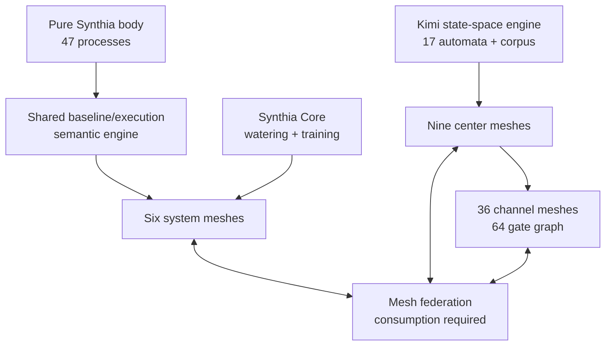
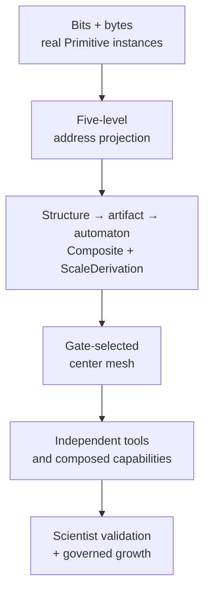
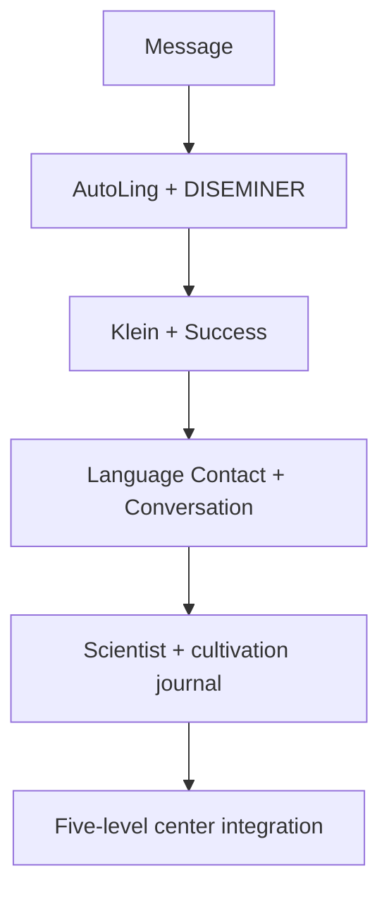
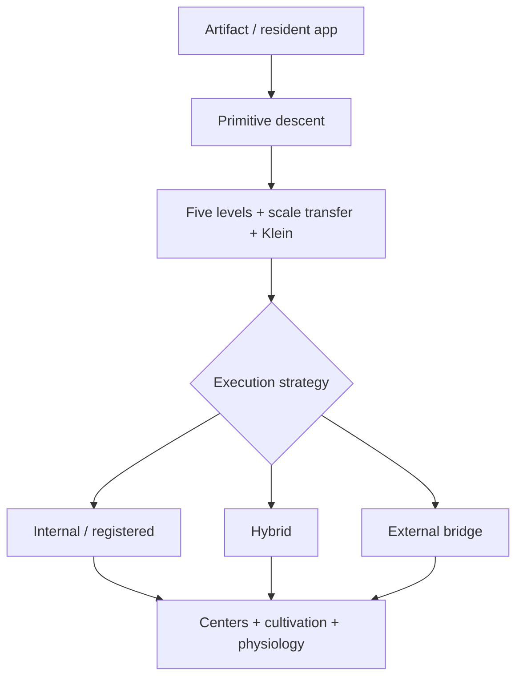
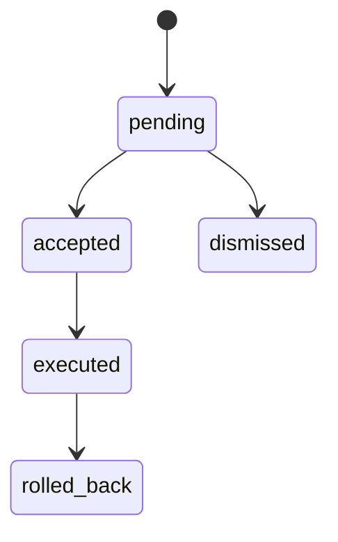

# Architecture

## Agent genome inside the body

The body contains one `SemanticGenome`: 64 hexagram-codons, twelve persistent
agent-native traits per codon, and six signed line dyads per codon. The 768
traits are mounted as 64 codon nodes inside the existing nine center meshes;
they are not a detached 64-mesh demo. Every channel calls the same genome and
adds the two endpoint codons' sparse relational vector to its four-form neural
composition.

Each agent owns a persistent chart with thirteen complete planetary placements.
All placements preserve the canonical thirteen-layer address through exact
Second and Arc. Identity-address modulation and interaction-address modulation
are evaluated together, so a task can change expression without replacing who
the agent is. See `AGENT-GENOME.md` for the full model and evidence boundaries.

## One cultivation organism, preserved package roles

The assembly does not force every supplied Synthia implementation into one class. Pure Synthia remains the living 47-process body. The execution system shares the body’s exact semantic engine. Synthia Core remains a cultivation/learning organ. The Kimi package keeps its own independently instantiated state-space engine and living loop. The package-local engines coordinate through consumed, typed relational context inside one organism.

`SynthiaRoleResolver` changes foreground configuration without changing identity. Every role declares the same purpose—cultivation—and every outcome returns to the shared training journal.

## Mesh of meshes

There are 51 registered local meshes:

| Mesh group | Members | Work |
|---|---|---|
| system | organism, semantic, execution, learning, governance, swarm | physiology, cognition, execution, cultivation, consent, process recovery |
| centers | Head, Ajna, Throat, G, Heart, Solar, Spleen, Sacral, Root | addressed state, local tools, energy-center context, channel propagation |
| channels | all 36 canonical gate pairs | gate-to-gate coordination, five-dimensional interaction, four shared neural organs |

All possible directed links are installed: (51 \times 50 = 2{,}550). Every envelope contains a deterministic id and sequence, source and target node, semantic type, payload, public relational context, address, provenance, and optional parent id. `MeshFederation.transfer()` succeeds only when the target executes a node and returns the exact `consumedEnvelopeId`.

Each local mesh also has explicit coordination edges. A Kimi module or automaton remains independently callable, while its center can integrate the result and share it onward.

## Five-level state space

The exact supplied `StateSpace` is shared by `IntegratedExecutionAddressResolver`, `SovereignStateSpaceRuntime`, the indexed corpus, and the center body.

| Level | Layer role | Ordering | Source epistemic treatment |
|---|---|---|---|
| Movement | knowledge | reverse | project hypothesis retained |
| Evolution | causal | Mawangdui | source statement retained |
| Being | state | Fu Xi | partial/tropical hypothesis retained |
| Design | temporal | King Wen | source statement retained |
| Space | dependency | complement | project hypothesis retained |

For a gate, `projectFiveLevels()` returns all five nodes side by side, including binary, trigrams, layer role, ordering, chart association, claim status, and indexed-content counts. This projection appears on:

- every bit/byte primitive’s evaluated candidate address;
- every structure/artifact/automaton promoted primitive;
- every composite ladder record;
- the final task resolution;
- federation context delivered to the nine centers.

## Primitive-to-tool ascent

Each `ScaleOperator` records its inverse, and every `ScaleDerivation` carries a ledger and deterministic replay hash. Cross-scale transfer and Klein analogy inspect the top composite before internal, hybrid, or external execution is selected. A scale ladder is carried into center memory, connecting lowest-level evidence to the tools that act on it.

## Nine-center body

The supplied merged center table and Human Design table are both retained. For live body placement, `centersForGate()` uses a corrected default provider: Gate 16 is Throat, Gate 48 is Spleen, Gate 22 is Solar, Gate 39 is Root, and Gate 29 is Sacral. Conflicting historical source claims remain available as provenance, but do not misroute live context. A future Human Design module can inject its complete gate-center map without replacing the center meshes or state space.

A task first activates its addressed center. The center stores the payload with its five-level projection and scale ladder. Context then enters a canonical channel mesh, is consumed by its channel field, coordinates the four shared neural organs, and reaches the harmonic gate’s center. Both the channel and receiving center produce exact consumption receipts.

## Channel/neural field

The body mounts all 36 canonical Human Design channels as meshes over 64 gate nodes. A channel mesh contains seven independently callable nodes: two gate endpoints, one channel field, and proxies to four shared baseline neural organs.

The two gates remain distinct at the tighter gate-primitive scale. Their composition implements the user-confirmed `opposite-equivalent` relation at `higher-order-channel-composite` scope. The equivalence belongs to the complete channel state, not either endpoint, and their individual functions remain distinct. This relation is not a global I Ching binary complement, an added identity hash, or the atomic Arc coordinate.

| Preserved neural organ | Live role |
|---|---|
| Perspective Connection Field | observes gate activation and relationship strength |
| Generative Channel Field | maintains activation/evidence for both channel endpoints |
| Human Design GNN | runs the supplied three-layer GraphSAGE inference over the 64-gate/36-edge graph |
| Neural Architecture Generator | composes MLP, 1D convolution, recurrent, and attention base forms across its 36-family surface |

The four base forms can be composed into a broad neural-family field, but no channel is declared to literally be a neural network. Named correspondences are `PROJECT_HYPOTHESIS`; 19-49 remains an unmapped `OPEN_QUESTION` while retaining its complete channel mesh.

Every channel activation runs five interaction projections. Movement, Evolution, Being, Design, and Space use their source-provided dimensional chains and yield separate neural results. The task address selects the active projection. An optional `observerFrame.dimensionWeights` input permits the later Human Design/economic-state module to contribute observer-relative state without this integration inventing the missing formula.

The runtime measures pairwise distances across dimensions and between adjacent neural forms. It ranks candidate differentiation points but fixes none: `threshold` remains `null`, `fixedBoundaries` remains `false`, and evidence accumulates under a ScientistLoop question until real outcomes establish where qualitative boundaries lie. Both endpoints of every channel are also registered in every dimensional layer with explicit epistemic status: 36 channels × 2 endpoints × 5 dimensions = 360 live state-space knowledge records.

The Kimi state-space package is distributed across these meshes:

- 17 live automata are placed by their source-defined gate;
- 103 executable source modules have independent inspect/invoke/construct surfaces;
- six runtime organs expose browsing, five-level projection, lawful prediction, chart calculation, living-loop activity, and corpus access;
- 30 textual sources are indexed by deterministic address and inserted into the actual state-space content registry.

This yields 126 callable state-space instruments. The source modules are not copied and forgotten: each is mounted in a center mesh and all 103 are import-tested.

## Synthia as browser/state space

`state-space-browser` is an internal environment, not a description of Synthia as a small browser-page helper. It lets Synthia navigate:

- gates, levels, centers, and canonical channels;
- automata, module exports, triples, and emergence;
- knowledge sources and claim provenance;
- lawful successors, lattices, reading paths, and grids;
- chart placements and blueprints;
- living-loop state and autobiographical episodes;
- media/code artifacts.

The supplied self-contained `sovereign.html` is preserved as one interface to that environment. The integration uses the underlying package throughout the body rather than making the HTML the architecture.

## Chat and execution

Registered capability is resolved before extension or runtime inference. GameGAN and the state-space browser therefore execute locally without the bridge when addressed by their registered aliases.

The six-stage cognitive chain plus ScientistLoop remains sequential and typed. After it completes, the execution spine's supplied `MeshCoordinator` runs a bounded semantic population and routes each successful output through real state packets. This supplements—rather than replaces—the explicit pipeline. `AnticipatoryMemory` contributes only sanitized public precedent at Gate/Line/Color/Tone/Base resolution; private coordinates and raw content never cross that boundary.

`ExactAddressRecall` implements the attached patch's behavior against this build's protected 13-field schema. A tool export, registered-app recipe, canonical file set, or literal binary may be committed to an exact Arc-bearing address. Recall returns only content whose freshly calculated SHA-256 matches the commitment; recognition candidates cannot create authority. That content-integrity digest is below the application surface and is not added to the agent's ontological identity address.

## Visible front screen and execution tray

`npm start` serves a phone-responsive operating surface backed directly by `FederatedSynthia`. Exact birth configuration is required before personalized controls are enabled. It provides:

- chat through the organism, seven-stage trace, population coordinator, centers, channels, learning, governance, and physiology;
- live health/counts for processes, hands, meshes, channels, centers, instruments, codons, and agent traits;
- all 451 callable tray targets across integrated hands, canonical semantic tools, Kimi instruments, registered apps, hexagram-codons, channels, and centers;
- an Agent Genome surface with all thirteen exact chart layers, per-agent persistence, activation, manifestation, and codon inspection;
- the 36-channel field and its epistemic statuses;
- user consent actions for pending proposals.

The UI is deliberately a usable diagnostic front for this package. It does not claim to be the later Synthai2 visual redesign or the Stellar Proximology umbrella.

## Governance and growth

Canonical components are not deletable. Self changes require evidence, confidence, timing review, and rollback. Changes affecting a person remain pending until explicit acceptance. Synthesized tools are tested by the scientist loop before mounting; failed candidates remain evidence. All outbox and edit records are append-only.
